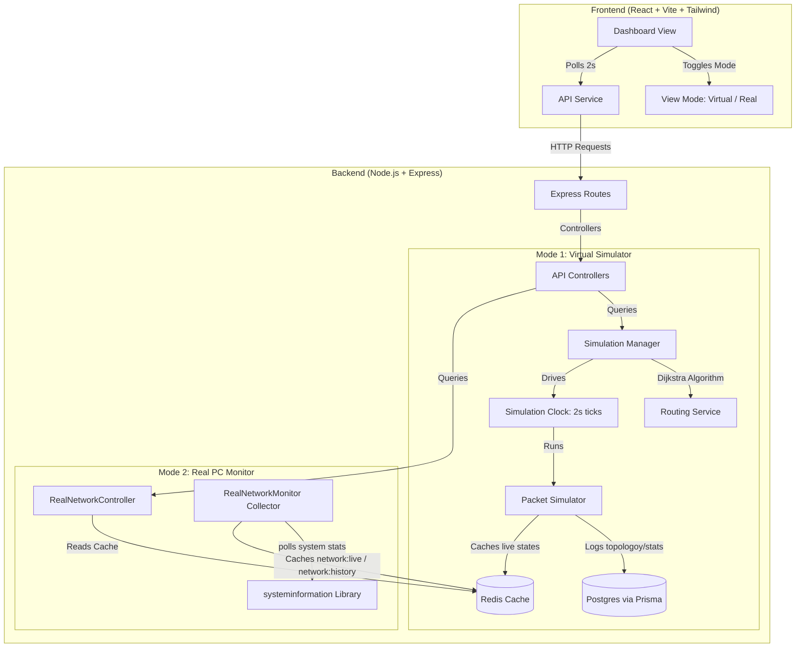

# Cloud Network Optimizer

An interactive web application designed to monitor, simulate, and optimize cloud network performance. The project offers two distinct feeds: a **Virtual Simulator** modeling packet routing and congestion on a simulated topology, and a **Real PC Monitor** tracking live hardware throughput from the host machine.

---

## Complete Flow & Architecture



### 1. Virtual Simulator Flow
- **Initialization**: On backend start, a default topology (routers and links) is loaded and synced with PostgreSQL.
- **Simulation Loop**: Every 2 seconds, the `SimulationClock` triggers a tick.
  - A **Traffic Generator** spawns packets with random sizes/rates between routers.
  - **Routing Service** uses Dijkstra's Algorithm to determine the shortest path.
  - **Packet Simulator** moves packets hop-by-hop. Queue sizes, propagation delays, packet delivery, and packet drops are processed.
  - Live statistics (latency, packet loss, throughput) are cached in Redis, and a snapshot of the run is saved in PostgreSQL.
- **Frontend Presentation**: The UI polls the metrics from Redis to draw the interactive topology, real-time lines, bottleneck tables, and congestion alerts.

### 2. Real PC Monitor Flow
- **Collection Loop**: A background service (`RealNetworkMonitor`) polls OS network interface statistics every 2 seconds via the `systeminformation` library.
- **Caching**: The latest download/upload speed (Mbps), active interface name, and status are cached under the Redis key `network:live`, and the last 30 readings are pushed and trimmed to the Redis list `network:history`.
- **Frontend Presentation**: Renders cards for connection metrics and a chronological Recharts `AreaChart` showing throughput trends.

---

## How to Get Started

### Prerequisites
- **Node.js** (v18+)
- **Redis Server** (listening on default port `6379`)
- **PostgreSQL Database**

### 1. Database Initialization
From the `backend/` folder, ensure database configuration is set in `.env` and sync schema:
```bash
cd backend
npx prisma db push
```

### 2. Start the Backend Server
```bash
cd backend
npm install
npm run dev
```
*Runs backend server on `http://localhost:3000` (or configured PORT).*

### 3. Start the Frontend Dashboard
```bash
cd ../frontend
npm install
npm run dev
```
*Launches development server on `http://localhost:5173` (proxied to backend).*

### 4. Running Tests
Run Jest tests to verify backend route and simulator logic:
```bash
cd ../backend
cmd /c npm test
```

---

## Features
- **Algorithm Optimization**: Exclusively uses Dijkstra's shortest path routing for packet propagation.
- **Dual Dashboard Modes**: Clean toggle switch between virtual mock topology telemetry and real OS networking cards.
- **Adaptive Performance**: Automatic 2-second telemetry fetching from Redis with pause/resume controls.
- **Graceful Shutdown**: Intercepts `SIGINT`/`SIGTERM` to clean up timers and disconnect database/Redis client bindings.

---

## Simulation Metrics Analysis & Test Scenarios

This section documents how the simulation engine operates, how metrics are computed, and includes 5 test scenarios (using topologies of at most 4 routers) to demonstrate different network conditions, congestion, and bottlenecks.

### Core Metrics Formulae
1. **Throughput (packets/tick)**: Calculated over a rolling 10-tick window as:
   $$\text{Throughput} = \frac{\text{Delivered Packets in Window}}{\text{Elapsed Ticks in Window}}$$
2. **Packet Loss (%)**: Calculated in the rolling window as:
   $$\text{Packet Loss} = \frac{\text{Dropped Packets}}{\text{Delivered Packets} + \text{Dropped Packets}}$$
3. **Average Latency (ticks)**: The average delivery time of all successfully delivered packets in the rolling window:
   $$\text{Average Latency} = \frac{\sum (\text{Delivery Tick} - \text{Creation Tick})}{\text{Delivered Packets}}$$
4. **Router Load (%)**: Calculated from queue occupancy relative to capacity:
   $$\text{Router Load} = \frac{\text{Current Queue Length}}{\text{Router Capacity}} \times 100$$
5. **Link Utilization (%)**: Determined by packets currently in transit (each active packet represents 10 Mbps of virtual consumption):
   $$\text{Link Utilization} = \frac{\text{Active Packets in Transit} \times 10 \text{ Mbps}}{\text{Link Bandwidth (Mbps)}} \times 100$$

---

### Test Scenario 1: Simple Linear Propagation (Normal Operation)
*   **Topology**: 3 Routers and 2 Links
    *   `R1` (Cap: 10, Rate: 2) $\leftrightarrow$ `R2` (Cap: 10, Rate: 2) $\leftrightarrow$ `R3` (Cap: 10, Rate: 2)
    *   Link `L1` (`R1` $\leftrightarrow$ `R2`): Latency = 2 ticks, Bandwidth = 100 Mbps
    *   Link `L2` (`R2` $\leftrightarrow$ `R3`): Latency = 3 ticks, Bandwidth = 100 Mbps
*   **Traffic Configuration**:
    *   Stream: `R1` $\rightarrow$ `R3` (Rate = 1 packet/tick, packet size = 500 Bytes)
*   **Congestion & Bottlenecks**: None. The traffic rate (1 pkt/tick) is lower than the router processing rates (2 pkts/tick).
*   **Expected Telemetry & Results**:
    *   **Throughput**: 1.0 packets/tick (steady state)
    *   **Average Latency**: 5.0 ticks (2 ticks on `L1` + 3 ticks on `L2` + 0 queuing delay)
    *   **Packet Loss**: 0%
    *   **Queues**: All router queues remain at 0.
    *   **Link Utilization**: `L1` is 20% (2 active packets), `L2` is 30% (3 active packets).

### Test Scenario 2: Router Processing Bottleneck (Queue Overflow)
*   **Topology**: 3 Routers and 2 Links
    *   `R1` (Cap: 10, Rate: 5) $\leftrightarrow$ `R2` (Cap: 5, Rate: 1) $\leftrightarrow$ `R3` (Cap: 10, Rate: 5)
    *   Link `L1` (`R1` $\leftrightarrow$ `R2`): Latency = 1 tick, Bandwidth = 100 Mbps
    *   Link `L2` (`R2` $\leftrightarrow$ `R3`): Latency = 1 tick, Bandwidth = 100 Mbps
*   **Traffic Configuration**:
    *   Stream: `R1` $\rightarrow$ `R3` (Rate = 2 packets/tick, packet size = 500 Bytes)
*   **Congestion & Bottlenecks**: **Processing Bottleneck at `R2`**. Traffic arrives at `R2` at a rate of 2 pkts/tick, but `R2` can only process 1 pkt/tick.
*   **Expected Telemetry & Results**:
    *   **Throughput**: 1.0 packets/tick (limited by `R2`'s processing rate of 1)
    *   **Packet Loss**: 50% (once `R2`'s queue fills to its capacity of 5, 1 out of every 2 arriving packets is dropped)
    *   **Average Latency**: 7.0 ticks (1 tick on `L1` + 5 ticks queuing delay inside `R2` + 1 tick on `L2`)
    *   **Queues**: `R2`'s queue stays full at 5/5 (100% Load, shown as Red in the UI).
    *   **Link Utilization**: `L1` is 20%, `L2` is 10%.

### Test Scenario 3: Dijkstra Shortest Path Routing Selection
*   **Topology**: 4 Routers and 4 Links
    *   `R1`, `R2`, `R3`, `R4` (All Cap: 10, Rate: 5)
    *   Link `L12` (`R1` $\leftrightarrow$ `R2`): Latency = 1 tick, Bandwidth = 100 Mbps
    *   Link `L24` (`R2` $\leftrightarrow$ `R4`): Latency = 6 ticks, Bandwidth = 100 Mbps
    *   Link `L13` (`R1` $\leftrightarrow$ `R3`): Latency = 2 ticks, Bandwidth = 100 Mbps
    *   Link `L34` (`R3` $\leftrightarrow$ `R4`): Latency = 2 ticks, Bandwidth = 100 Mbps
*   **Traffic Configuration**:
    *   Stream: `R1` $\rightarrow$ `R4` (Rate = 1 packet/tick)
*   **Congestion & Bottlenecks**: None. Shows path selection.
    *   Path 1 (`R1` $\rightarrow$ `R2` $\rightarrow$ `R4`): Total Latency = 7 ticks.
    *   Path 2 (`R1` $\rightarrow$ `R3` $\rightarrow$ `R4`): Total Latency = 4 ticks.
    *   Dijkstra selection chooses Path 2 (`R1` $\rightarrow$ `R3` $\rightarrow$ `R4`) as it has lower weight.
*   **Expected Telemetry & Results**:
    *   **Throughput**: 1.0 packets/tick
    *   **Average Latency**: 4.0 ticks (2 ticks on `L13` + 2 ticks on `L34` + 0 queuing delay)
    *   **Packet Loss**: 0%
    *   **Queues**: All queues remain at 0.
    *   **Link Utilization**: `L13` is 20%, `L34` is 20%. `L12` and `L24` are 0% (no packets route through them).

### Test Scenario 4: Severe Link Bandwidth Congestion
*   **Topology**: 3 Routers and 2 Links
    *   `R1` (Cap: 10, Rate: 5) $\leftrightarrow$ `R2` (Cap: 10, Rate: 5) $\leftrightarrow$ `R3` (Cap: 10, Rate: 5)
    *   Link `L1` (`R1` $\leftrightarrow$ `R2`): Latency = 1 tick, Bandwidth = 20 Mbps -- Low Bandwidth Link!
    *   Link `L2` (`R2` $\leftrightarrow$ `R3`): Latency = 1 tick, Bandwidth = 200 Mbps
*   **Traffic Configuration**:
    *   Stream: `R1` $\rightarrow$ `R3` (Rate = 3 packets/tick)
*   **Congestion & Bottlenecks**: **Bandwidth Bottleneck on Link `L1`**. The link carries 3 packets/tick. Since latency is 1, 3 active packets are on the link simultaneously. Each active packet represents 10 Mbps of virtual load, requiring 30 Mbps of bandwidth.
*   **Expected Telemetry & Results**:
    *   **Throughput**: 3.0 packets/tick
    *   **Average Latency**: 2.0 ticks (1 tick L1 + 1 tick L2 + 0 queuing delay, as routers process them immediately)
    *   **Packet Loss**: 0%
    *   **Queues**: All queues remain at 0.
    *   **Link Utilization**: `L1` utilization is **150%** (30 Mbps usage / 20 Mbps bandwidth), turning the link red and dashed in the graph to show severe bandwidth congestion. `L2` utilization is 15%.

### Test Scenario 5: Converging Traffic Streams (Interference Congestion)
*   **Topology**: 4 Routers in Y-shape and 3 Links
    *   `R1` (Cap: 10, Rate: 5), `R2` (Cap: 10, Rate: 5), `R4` (Cap: 10, Rate: 5)
    *   Converging Router `R3` (Cap: 5, Rate: 2)
    *   Link `L13` (`R1` $\leftrightarrow$ `R3`): Latency = 1 tick, Bandwidth = 100 Mbps
    *   Link `L23` (`R2` $\leftrightarrow$ `R3`): Latency = 1 tick, Bandwidth = 100 Mbps
    *   Link `L34` (`R3` $\leftrightarrow$ `R4`): Latency = 1 tick, Bandwidth = 100 Mbps
*   **Traffic Configuration**:
    *   Stream A: `R1` $\rightarrow$ `R4` (Rate = 2 packets/tick)
    *   Stream B: `R2` $\rightarrow$ `R4` (Rate = 2 packets/tick)
*   **Congestion & Bottlenecks**: **Converging processing bottleneck at `R3`**. Packets from both streams converge at `R3`, sending a combined traffic of 4 packets/tick. Since `R3` can only drain 2 packets/tick, its queue accumulates at a rate of 2 packets/tick, causing congestion.
*   **Expected Telemetry & Results**:
    *   **Throughput**: 2.0 packets/tick
    *   **Packet Loss**: 50% (once `R3` queue reaches its capacity of 5, 2 out of 4 converging packets are dropped every tick)
    *   **Average Latency**: 5.5 ticks (1 tick input link + 3.5 ticks queuing delay at `R3` + 1 tick output link)
    *   **Queues**: `R3` queue is full at 5/5. `R1`, `R2`, and `R4` queues are 0.
    *   **Link Utilization**: `L13` is 20%, `L23` is 20%, `L34` is 20% (carrying 2 processed packets/tick).

